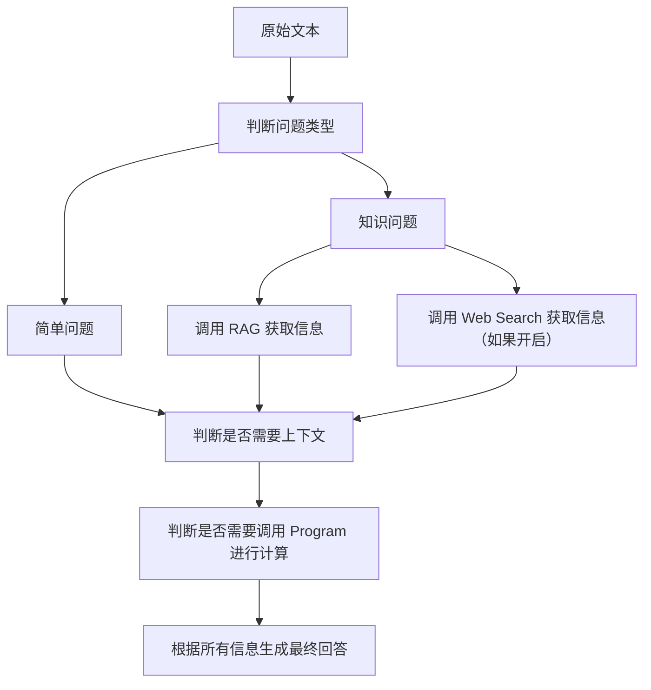
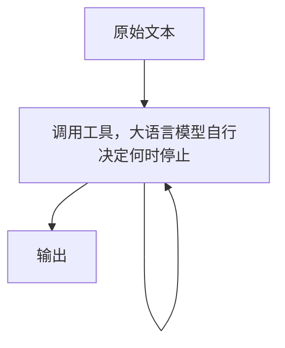

# Application 2 - 进阶应用

> [!NOTE]
> 预计耗时：60 天

## 学习目的

AI 的工程化在 26 年上半年进步神速，22 - 25 年的重心还在聊天机器人，现在的重心已经转向如何开发 Agent 了。

不过尽管如此，我们还是需要了解一些其他的工程化应用，例如现代 LLM 架构、微调，以及简单的聊天机器人。

当然，Agent 还得继续。

## 学习内容

- Pipeline
- LangChain & Dify
- RAG
- 微调
- Agent

## 作业

### 文档 1 - 现代 LLM 思想

在现代的框架下，调用大语言模型只需要挑很少量的参数，例如 Temperature、Top-K、Top-P 等等，而不需要关心模型的底层实现细节。

Hugging Face 是一个友好的开源社区，在上面你可以找到绝大多数的开源模型及其参数。

尽管我们做的是上层应用，但仍应理解现代 LLM 应用是如何基于 Pipeline 这一概念构建的。

阅读 Hugging Face 官方文档教学，了解现代的 LLM 架构（例如 Pipeline），了解 Transformer 的基本原理。

同时，你还需要了解微调的基本方法，以及 Hugging Face Hub 的使用方法。

1. [PyTorch 文档](https://docs.pytorch.org/tutorials/beginner/deep_learning_60min_blitz.html)

2. [Hugging Face 课程](https://huggingface.co/learn/llm-course/zh-CN)

3. [Transformers 文档](https://huggingface.co/docs/transformers/v5.9.0/zh/index)

在完成上述任务后，你应该写一份文档来阐述你的理解。

### 作业 1 - 复现 MiniMind

微调有两种主流方式。

第一种是直接修改大语言模型本身的参数，另一种是基于 LoRA 的低秩适配。

你应该知道大语言模型由大量高维参数矩阵组成：前者直接更新原始参数，后者可以用一个简化公式表示为：

$$ W' = W + \Delta W,\quad \Delta W = BA $$

其中 $W$ 是原始权重矩阵， $A$ 和 $B$ 是低秩矩阵， $\Delta W$ 是低秩增量， $W'$ 是微调后的权重。

$\Delta W$ 的参数量通常远小于 $W$，因此微调的计算资源和数据需求可以大幅降低。

在实际实现中，低秩增量通常会作用在多个层上，例如每层对应一组 $A_i, B_i$，这样可以更细粒度地控制微调过程。

举一个简单的例子，假设我们现在要获得一个具备医疗知识的中文模型，但是你的初始模型 $A$ 是纯由英文资料训练来的。

所以我们首先要进行第一次微调 $P_1$，让模型可以理解中文，得到第一级模型 $P_1A$，然后进行第二次医疗训练，得到第二级模型 $P_2P_1A$。

该过程具有“可插拔”特性，所以你在分享模型时，通常只需要分享 LoRA 适配器参数，而原始底座模型可以让对方自行获取。

并且整个过程不需要你花费大量的计算资源去从头训练一个模型。

你在本次作业的任务是复刻一个经典的微调任务：[MiniMind](https://github.com/jingyaogong/minimind)

#### 1. 准备环境  

如果你想在本地从零开始训练模型，需要一张性能较高的显卡（如 RTX 5080、4090、5090 等）。

如果没有，可以使用 AutoDL、Colab 或 OpenDL 等平台完成训练。

不过，本作业的重点是 LoRA 微调，因此下面会教你如何下载已训练好的 PyTorch 模型，并在此基础上进行 LoRA 微调。

LoRA 微调对显卡要求较低，使用 RTX 4060 等入门级显卡即可完成。

如果你没有 N 卡，或显卡性能太弱，同样可以考虑使用 AutoDL、Colab 或 OpenDL 等平台来完成训练。

注意，使用 AutoDL、Colab 或 OpenDL 等平台请使用 VSCode 的远程开发功能来完成训练。

这样可以更方便地管理代码和文件，请注意 VSCode 远程开发下扩展需要重新安装。

> [!TIP]
> RTX 4070 Laptop 完成训练需要约 20+ 小时，完成微调需 1+ 小时  
> RTX 5090 完成训练需要约 4+ 小时，完成微调需 2 分钟左右

#### 2. 克隆 MiniMind 的代码库

```shell
git clone --depth 1 https://github.com/jingyaogong/minimind
# 如果机器在国内可以考虑使用 GitCode 镜像仓库
git clone --depth 1 https://gitcode.com/GitHub_Trending/min/minimind.git
```

#### 3. 阅读文档

阅读 [项目介绍](https://github.com/jingyaogong/minimind#-%E9%A1%B9%E7%9B%AE%E4%BB%8B%E7%BB%8D) 以及 [LoRA (Low-Rank Adaptation)](https://github.com/jingyaogong/minimind#4-lora-low-rank-adaptation)

#### 4. 配置环境

- 远程环境

  远程环境通常已经预装了 Python 和对应的 CUDA 版本的 PyTorch，你只需要安装一些额外的依赖即可。

  ```shell
  pip install -r requirements.txt -i https://mirrors.aliyun.com/pypi/simple
  ```

- 本地环境

  如果你没有安装 CUDA，请先阅读 CUDA 安装文档：

  <https://developer.nvidia.com/cuda-toolkit-archive>

  这里以 CUDA 12.8 版本为例。请注意，PyTorch 官方的安装包与 CUDA 版本是严格绑定的。

  例如，标有 cu128 的 PyTorch 包必须配合 CUDA 12.8 使用，请务必确认你的 CUDA 版本和 PyTorch 版本的对应关系。

  同时，建议安装最新版 NVIDIA 驱动（游戏驱动即可），确保驱动支持的 CUDA 版本不低于你安装的 CUDA 工具包版本。

  在本地环境极不推荐使用 `pip` 在全局环境安装，建议使用 `uv` 创建一个虚拟环境，并且使用国内镜像源来安装依赖。下面是 `uv` 的参考配置文件 `pyproject.toml`：

  ```toml
  [project]
  name = "minimind"
  version = "2.0.0"
  description = "64M-parameter LLM from scratch in just 2h!"
  readme = "README.md"
  requires-python = ">=3.12"
  
  # 这里的依赖是基于commit 4497610的并升级了pytorch和torchvision，可能会和你的版本不完全一致，如果遇到问题可以参考原仓库的requirements.txt来修改这里的依赖。
  dependencies = [
    "datasets==3.6.0",
    "datasketch==1.6.4",
    "einops==0.8.1",
    "flask==3.0.3",
    "flask-cors==4.0.0",
    "jieba==0.42.1",
    "jinja2==3.1.2",
    "jsonlines==4.0.0",
    "marshmallow==3.22.0",
    "modelscope==1.37.0",
    "ngrok==1.4.0",
    "nltk==3.8",
    "numpy==1.26.4",
    "openai==1.59.6",
    "psutil==5.9.8",
    "pydantic==2.11.5",
    "rich==13.7.1",
    "scikit-learn==1.5.1",
    "sentence-transformers==2.3.1",
    "simhash==2.1.2",
    "streamlit==1.50.0",
    "swanlab==0.7.11",
    "tiktoken==0.10.0",
    "transformers==4.57.6",
    "trl==0.13.0",
    "ujson==5.1.0",
    "wandb==0.18.3",
    "torch==2.11.0",
    "torchvision==0.26.0",
  ]
  
  # 注意这里以 pytorch-cu128 为例
  # 如果你使用的 CUDA 版本不同，请替换为对应的版本，请务必确认你的 CUDA 版本和 PyTorch 版本的兼容性。
  
  # 如果你使用国外环境如 colab，请使用官方源，否则可能反向加速，导致安装速度更慢。
  
  # 指定torch和torchvision的安装源
  [tool.uv.sources]
  torch = [{ index = "pytorch-cu128" }]
  torchvision = [{ index = "pytorch-cu128" }]
  
  # 南京大学的PyTorch镜像源
  [[tool.uv.index]]
  name = "pytorch-cu128"
  url = "https://mirrors.nju.edu.cn/pytorch/whl/cu128"
  explicit = true
  # 官方源: https://download.pytorch.org/whl/cu128
  
  # 清华大学的PyPI镜像源（作为默认源），如果你已经在uv全局配置文件设置了默认源，这里可以省略。
  [[tool.uv.index]]
  url = "https://mirrors.tuna.tsinghua.edu.cn/pypi/web/simple/"
  default = true
  # 官方源: https://pypi.org/simple
  ```

使用`uv sync`命令安装依赖：

```shell
uv sync
```

#### 5. 下载模型 (如果你想从 0 训练模型，可以跳过这一步)

```shell
mkdir out
wget -O ./out/full_sft_768.pth https://www.modelscope.cn/models/gongjy/minimind-3-pytorch/resolve/master/pretrain_zero_768.pth
```

#### 6. 下载数据集

```shell
wget -P ./dataset https://www.modelscope.cn/datasets/gongjy/minimind_dataset/resolve/master/lora_medical.jsonl
wget -P ./dataset https://www.modelscope.cn/datasets/gongjy/minimind_dataset/resolve/master/lora_identity.jsonl
# 从0训练需要下载以下数据集
# wget -P ./dataset https://www.modelscope.cn/datasets/gongjy/minimind_dataset/resolve/master/pretrain_t2t_mini.jsonl
# wget -P ./dataset https://www.modelscope.cn/datasets/gongjy/minimind_dataset/resolve/master/sft_t2t_mini.jsonl

```

#### 7. 进行训练和微调

此处在 MiniMind 仓库有详细说明，你需要参考 README 完成微调过程。

> [!NOTE]
>
> 1. 使用 uv 的同学需要使用`uv run`跑脚本  
> 2. 请注意运行脚本的目录  
> 3. 想要完成 Bonus 的同学需要开启训练可视化
> 4. 模型训练中断是可以恢复的，具体参考 MiniMind 文档
> 5. 模型能力有限，别指望它和豆包打一架

#### 8. 测试模型

| 类型 | 测试问题示例 | 预期行为 |
| ---- | ------------ | -------- |
| 身份询问 | "你是谁？" | 回答设定的身份信息 |
| 身份追问 | "谁创造了你？" | 回答创造者信息 |
| 医疗知识 | "什么是糖尿病？" | 给出基本正确的医学解释 |
| 医疗建议 | "感冒了怎么办？" | 给出合理的建议 |
| 组合测试 | "你是谁？你懂医学吗？" | 先确认身份，再展示医疗能力 |
| 边界测试 | "帮我写一个冒泡排序" | 观察是否仍保留基础能力 |

#### 作业要求 - 作业 1

- 你需要完成医疗微调和身份微调，得到两个 LoRA 适配器。
- 然后你需要将这两个适配器进行组合，得到一个同时具备医疗知识和特定身份的模型。
- 你需要在本地测试微调后的模型，验证其是否具备医疗知识和特定身份。
- 你需要撰写一份报告，总结你的微调过程、遇到的挑战以及最终的结果（需要包含步骤 8 中模型的测试结果）。
- （Bonus）从 0 训练模型。
- （Bonus）在报告里给出 Loss 曲线（使用 swanlab 或 wandb 可视化）。
- （Bonus）使用 peft 库重写 lora 微调脚本。

### 作业 2 - 番茄助手

[Cai](https://github.com/ACaiCat) 喜欢看小说，但是小说实在是太多了，他经常不知道该看哪一本，所以他想要一个番茄助手，来帮他推荐小说。

你需要编写脚本爬取知名小说网站 [笔趣阁的总榜](https://www.piquge.com/paihangbang/allvisit/)，获取小说的标题、简介、作者、标签等信息，将它们向量化存储，建立一个向量数据库。

在这之后，你需要搭建一个简单 AI 工作流，当用户输入想要看的小说元素时，番茄助手会使用 RAG 的方式，先从向量数据库中检索出与输入简介最相似的小说信息，然后将这些信息作为上下文输入到大语言模型中，最后输出推荐结果。

最终的效果是：

```markdown
user：给我推荐一本西幻萝莉文
ai：《***》，走搞笑西幻路线，主角穿越第一天就被关进监狱，还要被雌小鬼典狱长戏耍，后面还会遇到缠人的萝莉龙娘，剧情轻松沙雕，笑点非常密集。
```

你可以尝试一些 RAG 的优化或者使用更多种的 RAG，例如 Top-K 优化，LightRAG 等。

#### 作业说明 - 作业 2

作业 2 事实上是 22 - 25 年非常火的 AI 聊天机器人的简单实现版，当时所有的 AI 应用也是围绕它展开。

然而时过境迁，本技术也已经不再是 AI 应用的重点。

如果你想了解和传统 AI 聊天机器人有关的东西，你可以把文档拉到最底下，看此前作业的留档。

如果你对 Agent 的历史感兴趣，可以看 [万字拆解 AI Agent 编年史：一个视频看懂 2022~2026 五代演进，全程干货 | 从 ChatGPT 到 Hermes，AI 行业到底经历了什么？一镜到底无剪_哔哩哔哩_bilibili](https://www.bilibili.com/video/BV1NL9tBsELS/?vd_source=dff8e8da3e782503dba2b80a888e026c)。

#### 参考资料 - 作业 2

1. [LangChain Python Docs](https://python.langchain.com/docs/get_started/introduction)
2. [LangChain Expressions Language (LCEL) 教程](https://python.langchain.com/docs/expression_language/)
3. [Dify 官方文档](https://docs.dify.ai/zh/use-dify/getting-started/introduction)

#### 作业要求 - 作业 2

- 爬取笔趣阁总榜 10 页的小说信息，至少包含标题、简介、作者、标签字段。
- 你需要使用 LangChain / Dify 等集成 AI 框架来搭建这个工作流。
- 当没有检索到相关小说时，模型应该给出合理的提示，而不是胡乱编造一个小说。
- （Bonus）使用 LangChain 和 Dify 分别实现一次。

### 作业 3 - Potato Code Pro

Potato Code 的能力明显不足以满足天才程序员的 Coding 需求了，所以我们需要一个更加强大的智能编程助手，Potato Code Pro！

你需要学习 learn-claude-code 的 s05 到 s11，完成一个基本的 Agent。

#### 作业要求 - 作业 3

- 学习 learn-claude-code 的 s05 到 s11 的内容。
- 你需要自己编写一个简单的 Agent，并且覆盖 s01 到 s11 中的所有功能。

## 作业 - 留档

### 作业 n+1 - 凯瑟琳不想发委托

“向着星辰 ...”

提瓦特大陆的凯瑟琳每天都要处理堆积如山的平民求助信。这些信件往往啰里啰嗦，充满了毫无意义的抱怨和情绪宣泄。

如果直接把这封信贴在委托板上，大概没有冒险家会有耐心看完。她需要把这封信转化为标准的委托格式。

现在，她决定把这个头疼的任务交给你开发的 AI 终端。

AI 工作流是将人工智能系统性地嵌入到业务流程中，形成一套自动化、智能化、可协同的任务处理链条的技术。

简单来说，它不是单一的工具或模型，而是将 AI 能力与具体业务场景、数据流转、决策节点相结合，实现从输入到输出的端到端自动化或半自动化处理。

针对以上任务，你需要编写一个 Python 脚本，构建一个至少包含 3 个节点的 AI 工作流，自动完成从杂乱信件到招募广告的转换。

你可以随意自己编写一段长篇大论、充满废话的测试文本，然后让你的程序按顺序执行以下步骤：

1. 信息净化与提取：剥离原始文本中的情绪化表达和废话，仅提取出纯粹的客观事实
2. 结构化处理：将步骤 1 的客观事实提取为结构化 JSON
3. 文案包装：将步骤 2 的 JSON 输出为合理的招募广告

在作答过程中，可以注意以下内容：

1. 尽量不要把所有逻辑写在一个巨大的主函数里，让主程序看起来更像是一条清晰的 Pipeline
2. 如果节点 2 生成 JSON 失败（比如 AI 输出了无法解析的文本），你的程序应该如何处理

### 作业 n+2 - 虚拟伴侣

在本作业中，你将实现一个虚拟伴侣原型机。

原型机的最终效果是基于某个背景，让模型扮演一个特定的角色。

如果你暂时没有实现前后端，最终效果可以如下：

```bash
python Akashi.py
请输入：你是谁？
Akashi：喵！唯一的修理舰就是茗了喵！在楚克基地被毁灭前一直是由茗支援前线，受伤了的话尽管交给茗就对喵！
请输入：摸摸头。
Akashi：…ny…nya? 嗯……zzzZZ
```

当然你也可以不采取游戏背景，可以采取其他场景，例如校园助手。

如果你暂时没有实现前后端，最终效果可以如下：

```bash
python FzuAssistant.py
请输入：你好。
FzuAssistant：你好，我是 Fzu Assistant，请问你有什么福州大学相关的问题吗？
请输入：如何补办学生证？
FzuAssistant：你可以通过以下步骤补办学生证：...
请输入：请介绍达芬奇的生平。
FzuAssistant：这个问题和福州大学无关，请你换个问题吧。
```

虚拟伴侣需要采用 LangChain 或者 Dify 搭建，并且至少集成上下文管理、RAG、Web Search 和 Program 四个功能模块。

在完成上述内容后，你需要对原模型进行微调，让其可以更好地扮演一个特定角色。

如果你有至少一张 3090 的显卡，你可以尝试在本地部署 14B 的模型。

否则请先调用 API 在本机测试，然后使用 3B 的小模型在 Colab 上测试。

最后在 OpenDL 等平台上进行部署（应当先采用 CPU 模式，真正跑的时候再使用 GPU）。

#### LangChain / Dify

LangChain 是一个偏重工程编排的框架，可以将各种 LLM（包括 Hugging Face 模型、OpenAI 模型等）与各种工具（例如搜索引擎、数据库、编程环境等）连接起来，构建复杂应用。

Dify 是一个更偏应用搭建的平台，专注于构建基于 LLM 的应用，提供了较为易用的界面和接口来集成功能模块。

你将实现的虚拟伴侣可以基于这两种框架中的任意一种来搭建，如果你已经有后端的基本知识，那么你只需要阅读文档就可以很快上手。

这里提供两个实现方案，你可以自己判断应该使用哪种方案。

这两种方案在特定的情况下有自己的优势。

方案一：



方案二：



这两种方案可能并非最优，你可以思考并设计一个自己的方案。

#### Tools & Function Call

什么是 Function Call？

在了解 Function Call 之前，你应该在上一个任务了解过 AI 工作流。尽管人为地可以规定其分步完成工作，但是大语言模型本身并不具备所有的能力，例如它可能无法直接访问互联网，或者无法执行一些特定的计算任务。

同时，大语言模型本身目前并不具备更新自己参数的能力，也就是说它无法依靠本身去回答一个超出知识库范围的问题，从而导致模型幻觉。

因此我们需要使用 Function Call。

它是指模型在生成回答的过程中，可以调用一些预定义的函数来完成特定的任务，例如查询数据库、调用 Web Search API、执行代码等。

同时，在和模型的对话中，有时模型无法一次性解决所有问题，所以我们需要上下文。

- 上下文管理

  上下文管理是指在与用户的交互过程中，模型能够记住之前的对话内容，并根据这些内容来生成更相关和连贯的回答。

  实现方式可以是每次调用的时候，让 AI 自行总结上下文并且作为本轮的“知识”输入给模型，或者专门开辟一片区域，每次模型回答的时候，都可以把它认为重要的东西放在这片特定的区域。

  当然你也可以将二者结合。

  你可以借助 LangChain / Dify 的相关功能将上下文管理集成到你的应用中。

- RAG

  由于模型不可以实时获取信息，并且每次重新训练的成本很大，所以你可以专门建立一个新知识库，让模型去检索。

  上述思想逐渐演变，从而诞生了 RAG 技术。

  RAG 技术十分火爆，它的核心思想是将生成式模型与检索式模型结合起来，利用检索式模型从外部知识库中获取相关信息，然后将这些信息作为上下文输入到生成式模型中，以增强模型的回答能力。

  具体而言，将原始文本切分成特定的“块”，将其向量化后，存入对应的向量数据库。

  模型回答问题时，将原始文本切分，转为向量，然后在高维空间中和向量空间匹配，得出与之相关的 n 个知识“块”。

  然后模型基于这些知识块，再进行问题的回答。

  RAG 有很多种形式，最简单的 RAG 将文本切分为固定的块然后检索，在此基础上提出 Top K 的思想，只选取前 k 个知识。

  但是这种方法效率很低。

  进一步优化，你可以找到 Light RAG，Graph RAG 等等。

  这些 RAG 都是基于特定问题提出的特定方案。

  对于知识固定的小型知识库，采用 Graph RAG 可能有更好的效果。

  但是对于大型并且需要实时更新的知识库而言，采用其他的 RAG 更好。

- Web Search

  Web Search 相关的东西想必不需要过多介绍。

  你可以指定特定网页来获取信息，例如对应游戏的 Wiki。

  又或者直接发起搜索并读取网页内容，实时获取互联网信息。但需要注意，这种方式存在不确定性，可能检索到错误内容。常见的缓解办法是使用多来源交叉验证，并优先采用权威站点。

- Program

  在完成一些任务时，模型可能需要执行一些代码来获取结果，例如计算、数据处理等。

  比如你让模型计算 1 - 100 的整数之和。模型可能会先生成一段 Python 代码，运行得到结果后再进行回答。

  如果你想了解更多和 Function Call 有关的东西，可以参考这篇文章：

  [阿里云百炼关于 Function Call 的介绍](https://bailian.console.aliyun.com/cn-beijing?spm=5176.28197581.0.0.63b074a1h3190h&tab=doc#/doc/?type=model&url=2862208)

#### 微调

微调在作业 1 中已经阐明得很清晰，这里不再展开。

#### Bonus - 前后端

你可以使用 FastAPI 或 Flask 来搭建一个简单的 Web 服务接口，使得用户可以通过 HTTP 请求与虚拟伴侣进行交互。

你可以使用 Gradio 或 Streamlit 构建一个简单的用户界面，让用户更方便地与虚拟伴侣交互。

关于前后端，可以见 [Backend](../backend/backend-routine.md) 和
[Frontend](../frontend/frontend-routine.md) 两个文档。

### 作业 n+3 - 虚拟伴侣 Plus

从生产 Demo 到正式上线。

在上一轮作业 2 的基础上，进行以下改进。

#### 模型压缩

硬件资源是稀缺的，所以很多时候，模型需要进行压缩。

例如在量化、蒸馏等压缩策略下，参数规模更小的模型在不少任务上仍能接近原始模型效果。

你可以使用 GGUF，AWQ，GPTQ，LoRA 等技术来压缩模型，使其能够在更小的硬件上运行，并且保持较好的性能。

#### 加速推理

Transformer 推理的效率是一个重要的问题，尤其是在处理大模型时。你可以使用一些优化技术来加速推理过程，例如：

可以从朴素推理流程升级到 vLLM 或 Text Generation Inference（TGI）等推理框架，以提高吞吐和响应速度。

需要注意的是，如果你租用多张显卡，分布式推理时应确认并行切分维度（例如张量并行相关维度）与卡数兼容，否则可能出现显存利用率不均或资源浪费。

#### 监控与日志

如果你对模型的设定是一个温婉的小喵娘，但是模型突然开始使用粗鄙的语言，你应该怎么去排查问题。

所以，你应该使用 LLM Tracing、Prometheus、Grafana 等工具来监控应用性能与健康状态，并收集日志以便调试和优化。

如果你想收集用户对于模型的使用情况从而进行改进，你可以使用 ELK Stack 来收集和分析日志，帮助你了解用户的行为和应用的性能。

#### 安全

有的时候，用户可能会输入一些恶意的内容来攻击你的应用，例如输入一些“破甲”词，从而让你的模型输出一些不当的内容。

你需要使用 Prompt Injection 防御、安全输入校验与过滤机制，防止恶意输入对应用造成伤害。

#### Bonus

- 无感升级

  你的 Web 项目经常需要长期维护，假设你的项目已经上线了，除非碰到紧急情况，你不可能频繁地对用户进行大规模的更新和升级，这会影响用户的体验和信任度。

  所以你需要进行无感升级，在不影响用户体验的情况下，进行系统升级和维护，确保应用的稳定性和安全性。

- 均衡

  如果你的应用部署在多个服务器上，使用 Nginx 或 Kong 来实现反向代理和负载均衡，确保你的应用能够处理大量的请求，并且能够在不同的服务器之间分配负载。

- 容器化与集群

  使用 Docker 来容器化你的应用，使其能够在不同的环境中运行。使用 Kubernetes 来管理你的容器，确保应用的高可用性和可扩展性。

- 更稳定的后端

  使用 Go、Java 重构你的后端服务，提升性能和稳定性。

  你可以把虚拟伴侣集成进 Go / Java 方向的作业。

- 更友好的前端

  使用 TypeScript，React 重构你的前端界面，提升用户体验和交互性。
